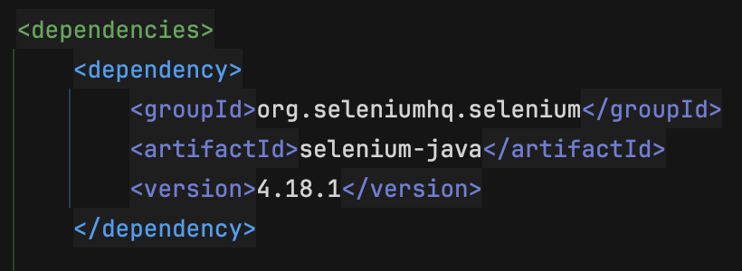

<!-- PROJECT SHIELDS -->

<!-- PROJECT LOGO -->
<br />
<div align="center">
  <a href="https://github.com/markveszelka/selenium-page-factory">
    
  </a>

<h3 align="center">Page Factory Design Pattern with Selenium</h3>

  <p align="center">
    Study project - Teamwork
    <br />
    <a href="https://github.com/markveszelka/selenium-page-factory"><strong>Explore the docs »</strong></a>
    <br />
    <br />
  </p>
</div>


<!-- ABOUT THE PROJECT -->

## About The Project

[![Product Name Screen Shot][product-screenshot]](https://github.com/markveszelka/selenium-page-factory)

This project utilizes Selenium WebDriver to automate test cases on a practice Selenium webpage. It serves as a study
project focusing on the implementation of automation testing, employing the Page Factory Design Pattern alongside
Keyword- and Data-driven testing practices. Additionally, it utilizes Java and object-oriented programming (OOP)
principles.

<p align="right">(<a href="#readme-top">back to top</a>)</p>

### Built With

- [![Github][Github]][Github-url]
- [![Java][Java]][Java-url]
- [![Jira][Jira]][Jira-url]
- [![Selenium][Selenium]][Selenium-url]
- [![IntelliJ][IntelliJ.idea]][IntelliJ-url]
- [![Maven][Maven]][Maven-url]

<p align="right">(<a href="#readme-top">back to top</a>)</p>

<!-- GETTING STARTED -->

## Getting Started

You can clone the project and install it to see it in action.

### Prerequisites

[![Maven][Maven]][Maven-url]

To build and manage the project dependencies, Maven is required. You can install Maven by following the steps below:

* On macOS
  ```sh
  brew install maven
  ```
* On Windows
  ```sh
  choco install maven
  ```

### Installation

1. Clone the repo
   ```sh
   git clone git@github.com:markveszelka/selenium-page-factory.git
   ```
2. Install the dependencies using Maven
   ```sh
   mvn install
   ```
3. Feel free to look around in the test directory, and run the test using the IDE

<p align="right">(<a href="#readme-top">back to top</a>)</p>

<!-- CONTACT -->

## Contact

Mark Veszelka - [github](https://github.com/markveszelka) - [linkedin](https://www.linkedin.com/in/mark-veszelka/) -
mark.veszelka@gmail.com

Project Link: https://github.com/markveszelka/selenium-page-factory

<p align="right">(<a href="#readme-top">back to top</a>)</p>


<!-- MARKDOWN LINKS & IMAGES -->
<!-- https://www.markdownguide.org/basic-syntax/#reference-style-links -->

[contributors-shield]: https://img.shields.io/github/contributors/othneildrew/Best-README-Template.svg?style=for-the-badge

[contributors-url]: https://github.com/nagmil2077/stackoverflow-tw/graphs/contributors

[forks-shield]: https://img.shields.io/github/forks/othneildrew/Best-README-Template.svg?style=for-the-badge

[forks-url]: https://github.com/othneildrew/Best-README-Template/network/members

[stars-shield]: https://img.shields.io/github/stars/othneildrew/Best-README-Template.svg?style=for-the-badge

[stars-url]: https://github.com/othneildrew/Best-README-Template/stargazers

[issues-shield]: https://img.shields.io/github/issues/othneildrew/Best-README-Template.svg?style=for-the-badge

[issues-url]: https://github.com/othneildrew/Best-README-Template/issues

[license-shield]: https://img.shields.io/github/license/othneildrew/Best-README-Template.svg?style=for-the-badge

[license-url]: https://github.com/othneildrew/Best-README-Template/blob/master/LICENSE.txt

[linkedin-shield]: https://img.shields.io/badge/-LinkedIn-black.svg?style=for-the-badge&logo=linkedin&colorB=555

[linkedin-url]: https://linkedin.com/in/othneildrew

[product-screenshot]: images/product_screenshot.png

<!-- STACKS -->

[Selenium]: https://img.shields.io/badge/-selenium-%43B02A?style=for-the-badge&logo=selenium&logoColor=white

[Selenium-url]: https://www.selenium.dev

[Jira]: https://img.shields.io/badge/jira-%230A0FFF.svg?style=for-the-badge&logo=jira&logoColor=white

[Jira-url]: https://www.atlassian.com/software/jira

[IntelliJ.idea]: https://img.shields.io/badge/IntelliJ_IDEA-000000.svg?style=for-the-badge&logo=intellij-idea&logoColor=white

[IntelliJ-url]: https://www.jetbrains.com/idea/

[Github]: https://img.shields.io/badge/GitHub-100000?style=for-the-badge&logo=github&logoColor=white

[Github-url]: https://github.com

[Stackoverflow]: https://img.shields.io/badge/Stack_Overflow-FE7A16?style=for-the-badge&logo=stack-overflow&logoColor=white

[Stackoverflow-url]: https://stackoverflow.com

[Java]: https://img.shields.io/badge/Java-ED8B00?style=for-the-badge&logo=openjdk&logoColor=white

[Java-url]: https://www.java.com/en/

[Spring]: https://img.shields.io/badge/Spring-6DB33F?style=for-the-badge&logo=spring&logoColor=white

[Spring-url]: https://spring.io

[Maven]:    https://img.shields.io/badge/Apache%20Maven-C71A36?style=for-the-badge&logo=Apache%20Maven&logoColor=white

[Maven-url]: https://maven.apache.org

[Hibernate-url]: https://hibernate.org/

[Hibernate]: https://img.shields.io/badge/Hibernate-59666C?style=for-the-badge&logo=Hibernate&logoColor=white

[Docker]: https://img.shields.io/badge/docker-2496ED?style=for-the-badge&logo=docker&logoColor=white&labelColor=1D63ED&color=1D63ED

[Docker-url]: https://www.docker.com/

[Javascript]: https://img.shields.io/badge/JavaScript-F7DF1E?style=for-the-badge&logo=javascript&logoColor=black

[Javascript-url]: https://www.javascript.com

[CSS]: https://img.shields.io/badge/CSS-239120?&style=for-the-badge&logo=css3&logoColor=white

[CSS-url]: https://developer.mozilla.org/en-US/docs/Web/CSS

[HTML5]: https://img.shields.io/badge/HTML5-E34F26?style=for-the-badge&logo=html5&logoColor=white

[HTML5-url]: https://en.wikipedia.org/wiki/HTML5

[Vite]: https://img.shields.io/badge/vite-646CFF?style=for-the-badge&logo=vite&logoColor=white&labelColor=8C72FE&color=8C72FE

[Vite-url]: https://vitejs.dev/
